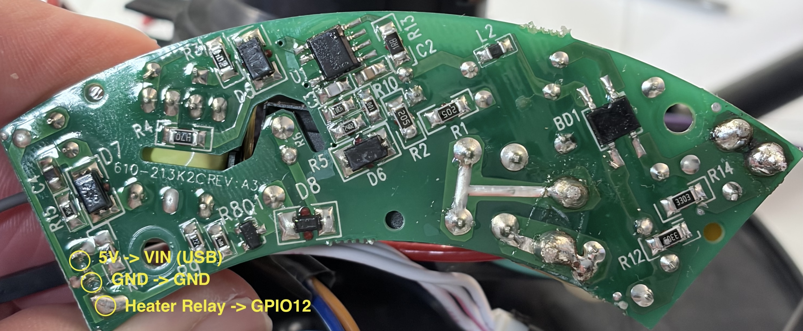
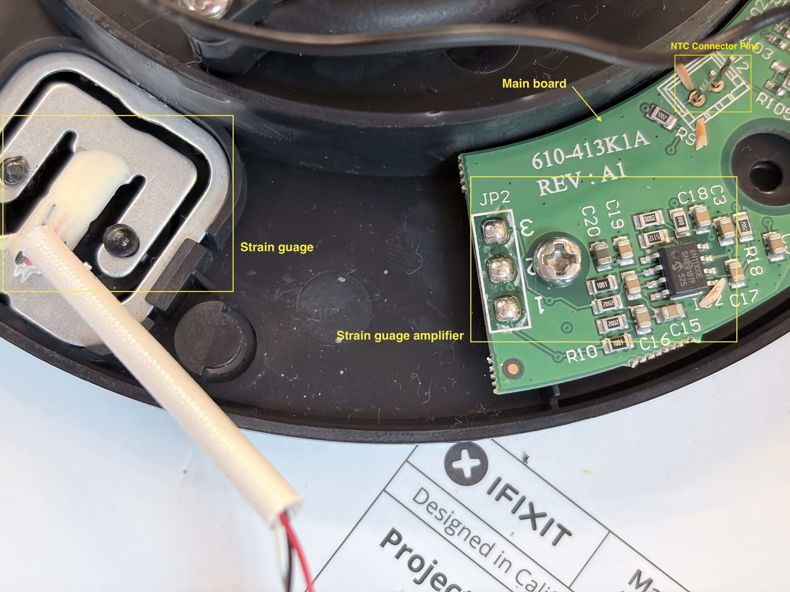

I have a Smarter iKettle v3 and I really like the features and aesthetics, but since they stopped paying the bills Electric Imp has soft-bricked the kettles by blocking them from accessing their cloud infrastructure. Below is a description of how I replaced the Electric Imp controller with an ESP32 board. I wired everything by jamming the pins of jumper wires into the existing connectors, so it is completely non-destructive and reversible sans four small solder points.

# Parts Used:

- [Adafruit ESP32-S2 Feather](https://learn.adafruit.com/adafruit-esp32-s2-feather) You can use any ESP32 you like, but this one is high quality and fits neatly in the base.
- Optional: [Adafruit HX711 24-bit ADC](https://learn.adafruit.com/adafruit-hx711-24-bit-adc) if you want to try to get the strain gauge working for the water level (I'm still waiting for mine to arrive so I haven't tested it yet)
- 47 kOhm resistor
- 10 kOhm resistor
- 100 Ohm resistor
- Jumper wires

# iKettle Innards

- Main board: this is the longer of the two PCBs. It houses the Electric Imp chip, strain sensor amplifier, WiFi, physical button and LEDs.
- Daughter board: this is the smaller of the two PCBs. It houses the AC/DC transformer for 5V power and the relay to connect mains power to the kettle base. The two boards are connected by three white wires. The outer wires are 5V DC power and the Heater Relay, the middle is GND. If you unscrew the daughter board and flip it over you can see the three pins from the wires, which I've labeled in the picture below. Make sure you correctly map them to the connector pins on the top of the board.

- Kettle base connector. This the piece of plastic in the middle with concentric rings and some thick wires coming out of it.
- NTC [thermsistor](https://en.wikipedia.org/wiki/Thermistor) connector. The kettle houses a 50 kOhm thermsistor that makes contact in the second and third rings from the innermost ring. Look for a thin black and thin red wire that terminate at a connector on the main board.
- Physical button. This is just a momentary switch soldered on to the main board. There are four posts. The pair closest to the front edge (nearest the button when assembled) closes when the button is depressed, this is where I soldered wires for the button switch.
- LED ring: the LED ring light sits just above the button on two posts. If you look at the clear plastic part, you will see the post (smaller electrode) and anvil (larger). The post is the anode (+) and it needs a 100 Ohm resistor between it and the GPIO pin.
- The strain gauge is attached to the rubber foot of the base. I de-soldered the three wires from the amplifier on the main board for future connection to an external amplifier, so you just see the empty pads on the main board. I hope to get that working once my HX711 arrives.
  

# Connections

- Disconnect the plug from the main board, leaving the other end plugged into the daughter. The free end of the connector has three female pins: insert a jumper wire into the center pin and connect it the common ground and the GND terminal on the Feather. I just soldered a bunch of pins together and tied all the ground wires together.
- Figure out which pin is the Heater Relay and which is the 5V. **Warning** It is super important not to mix them up because you can fry the Feather by putting 5V on the GPIO pin.
- Connect the 5V pin to the USB pin on the Feather (this is called different things on different boards, but it is the input voltage that powers the whole board).
- Connect the Heater Relay to GPIO12. **Note:** the relay Heater Relay pin takes 3.3V even though the relay is a 5V switch; the daughter board uses a MOSFET to pull the relay to 5V.
- To be clear: the GND, 5V and GPIO12 pins terminate on the daughter board, via the white wire; we are effectively replacing the entire main board with the Feather.
- Disconnect the NTC connector from the main board. (In the picture above, you see the male pins on the main board after the connector is removed.) The free end of the connector has two female pins: Connect the red wire to GPIO A5 and the black wire to GND. (It actually doesn't matter which is which.) It is essential that you use a pin on [ADC1](https://cdn-learn.adafruit.com/assets/assets/000/110/677/original/adafruit_products_Adafruit_Feather_ESP32-S2_Pinout.png?1649709383) because ADC2 is used by WiFi.
- Connect the other end of the 100 Ohm resistor from the LED anode to GPIO 10.
- Connect the LED cathode (the one connected to the anvil, the larger electrode) to GND
- Connect one of the physical button wires to GPIO5 (doesn't matter which one) and the other to GND
 - On the back of the Feather, solder a 10 kOhm resistor from 3V -> GPIO5
 - On the back of the Feather, solder a 47 kOhm resistor from 3V -> GPIOA5
   

# ESPHome Yaml

- If you use an ESP32-S2 Feather wired the way I have it pictured, you only have to update the encryption key and wifi credentials
- If you use a different board, you can define the pins in the "Configuration Variables" section
```yaml
esphome:
  name: "ikettle"
  friendly_name: "iKettle S2"
  on_boot:
    priority: -10
    then:
      - text_sensor.template.publish:
          id: fault_status
          state: "OK"

esp32:
  #board: adafruit_feather_esp32s2
  board: esp32-s2-saola-1
  variant: ESP32S2
  framework:
    type: arduino

wifi:
  ssid: !secret wifi_ssid
  password: !secret wifi_password

api:
  encryption:
    key: !secret encryption_key

ota:
  - platform: esphome
    id: ota_esphome

logger:

# -----------------------------------------------------------------
# Configuration variables
# -----------------------------------------------------------------
substitutions:
  temperature_pin: GPIO8  # labeled 'A5' must be ADC1 to avoid wifi conflict
  temperature_resistor: 47kOhm # Ideally 47 - 100 kOhm
  led_pin: GPIO10
  button_pin: GPIO5 # 10 kOhm resistor to 3.3V
  heating_pin: GPIO12
  default_target_temp: 85 # The default target temp on startup


# -----------------------------------------------------------------
# Do not edit below this line
# -----------------------------------------------------------------


# ----------------------------------------------------------------
# FAULT STATUS SENSOR
# ----------------------------------------------------------------
text_sensor:
  - platform: template
    name: "Kettle Fault Status"
    id: fault_status
    update_interval: never

# ----------------------------------------------------------------
# SENSORS (ADC & NTC)
# ----------------------------------------------------------------
sensor:
  - platform: ntc
    id: water_temp
    name: "Water Temperature"
    sensor: resistance_sensor
    calibration:
      b_constant: 3950
      reference_temperature: 25°C
      reference_resistance: 50kOhm

  - platform: resistance
    id: resistance_sensor
    sensor: source_sensor
    configuration: DOWNSTREAM
    resistor: ${temperature_resistor}
    internal: true

  - platform: adc
    id: source_sensor
    pin: ${temperature_pin}
    attenuation: 12db
    update_interval: 0.5s
    filters:
      - sliding_window_moving_average:
          window_size: 10
          send_every: 2
          

# ----------------------------------------------------------------
# HARDWARE: LED & BUTTON
# ----------------------------------------------------------------

output:
  - platform: ledc
    pin: ${led_pin}
    id: led_gpio
    frequency: 1000Hz

light:
  - platform: monochromatic
    name: "Kettle LED"
    output: led_gpio
    id: kettle_led
    effects:
      # Effect 1: "Breathing" for Keep Warm (Classy)
      - pulse:
          name: "Slow Blink"
          update_interval: 2s      # One breath every 2 seconds
          transition_length: 1s    # Smooth fade in/out
          min_brightness: 0%
          max_brightness: 100%

      # Effect 2: "Machine Gun" Strobe for Errors (Urgent)
      - pulse:
          name: "Fast Blink"
          update_interval: 0.2s    # 5 blinks per second
          transition_length: 0s    # Instant ON/OFF (No fade)
          min_brightness: 0%
          max_brightness: 100%

binary_sensor:
  - platform: gpio
    pin:
      number: ${button_pin}
      mode: INPUT_PULLUP
      inverted: true
    name: "Physical Button"
    id: physical_button
    internal: true # Hide from HA, we send events instead
    on_multi_click:
      - timing:
          - ON for at most 1s
          - OFF for at most 1s
          - ON for at most 1s
          - OFF for at least 0.2s
        then:
          - homeassistant.event:
              event: esphome.kettle_button_event
              data:
                click_type: double
      - timing:
          - ON for at most 1s
          - OFF for at least 0.2s
        then:
          - homeassistant.event:
              event: esphome.kettle_button_event
              data:
                click_type: single
    
    # ----------------------------------------------------------------
    # GLOBAL STATE SENSORS
    # ----------------------------------------------------------------

  - platform: template
    name: "Boiling"
    id: boiling_status
    icon: "mdi:kettle-steam"
    
  - platform: template
    name: "Keep Warm"
    id: keeping_warm_status
    icon: "mdi:thermometer-check"

# ----------------------------------------------------------------
# HARDWARE SWITCH (Updated)
# ----------------------------------------------------------------
switch:
  - platform: gpio
    pin: ${heating_pin}
    id: relay_hardware
    internal: true
    restore_mode: ALWAYS_OFF
    
    # START the watchdog when relay turns ON
    on_turn_on:
      - script.execute: safety_watchdog
      
    # KILL the watchdog when relay turns OFF
    # This prevents "zombie timers" from killing your Keep Warm session
    on_turn_off:
      - script.stop: safety_watchdog


  # ----------------------------------------------------------------
  # 2. UI SWITCH 
  # ----------------------------------------------------------------
  - platform: template
    name: "Start Heating"
    id: kettle_active
    icon: "mdi:kettle"
    optimistic: true
    turn_on_action:
      - lambda: 'id(fault_status).publish_state("Heating");'
    turn_off_action:
      - switch.turn_off: relay_hardware
      - lambda: 'id(fault_status).publish_state("Idle");'


# ----------------------------------------------------------------
# SAFETY WATCHDOG SCRIPT
# ----------------------------------------------------------------
script:
  - id: safety_watchdog
    mode: restart
    then:
      - delay: 15min
      
      # Use standard YAML action instead of C++ syntax
      - switch.turn_off: relay_hardware
      - switch.turn_off: kettle_active
      
      # Set status LAST so it overwrites the "Idle" status from kettle_active
      - lambda: 'id(fault_status).publish_state("Safety Timeout");'
      - logger.log: "Emergency Safety Cutoff Triggered!"

# ----------------------------------------------------------------
# 3. UI SLIDERS (Target & Timer)
# ----------------------------------------------------------------
number:
  - platform: template
    name: "Target Temperature"
    id: target_temp
    icon: "mdi:thermometer-lines"
    unit_of_measurement: "°C"
    min_value: 40
    max_value: 100
    step: 1
    restore_value: true
    initial_value: ${default_target_temp}
    optimistic: true

  - platform: template
    name: "Keep Warm Time"
    id: keep_warm_mins
    icon: "mdi:timer-outline"
    unit_of_measurement: "min"
    min_value: 0
    max_value: 30
    step: 1
    restore_value: true
    initial_value: 0
    optimistic: true

# ----------------------------------------------------------------
# 4. CONTROL LOOP (The Brains)
# ----------------------------------------------------------------
interval:
  - interval: 1s
    then:
      - lambda: |-
          // STATE VARIABLES
          static unsigned long hold_start_time = 0;
          static float last_temp = 0.0;
          
          bool active = id(kettle_active).state;
          float current = id(water_temp).state;
          float target = id(target_temp).state;
          float keep_warm = id(keep_warm_mins).state;
          float hyst = 2.0;

          // ----------------------------------------
          // 1. DATA SANITY & RATE OF CHANGE
          // ----------------------------------------
          if (isnan(current) || current < 10.0) {
            if (active || id(relay_hardware).state) {
              id(relay_hardware).turn_off();
              id(kettle_active).turn_off(); 
              id(fault_status).publish_state("Error: Kettle Missing");
              
              // RESET STATE SENSORS
              id(boiling_status).publish_state(false);
              id(keeping_warm_status).publish_state(false);
              
              hold_start_time = 0;
            }
            last_temp = current;
            return;
          }

          // Calculate Rate (Deg per second)
          float rate = 0.0;
          // Only calculate rate if we have a valid previous reading
          if (last_temp > 1.0) { 
              rate = current - last_temp; 
          }
          last_temp = current; // Update this at the end

          // ----------------------------------------
          // 2. SAFETY CHECKS
          // ----------------------------------------
          
          // A. DRY BOIL (Latched)
          if (active && rate > 8.0) {
             ESP_LOGE("safety", "Dry Boil Detected! Rate: %.2f", rate);
             id(relay_hardware).turn_off();
             id(kettle_active).turn_off(); 
             id(fault_status).publish_state("Error: Dry Boil");
             
             // RESET STATE SENSORS
             id(boiling_status).publish_state(false);
             id(keeping_warm_status).publish_state(false);
             
             return;
          }

          // B. OVERHEAT
          if (current > 108.0) {
            id(relay_hardware).turn_off();
            id(kettle_active).turn_off();
            id(fault_status).publish_state("Error: Overheat");
            
            // RESET STATE SENSORS
            id(boiling_status).publish_state(false);
            id(keeping_warm_status).publish_state(false);
            
            return;
          }

          // ----------------------------------------
          // 3. THERMOSTAT LOGIC
          // ----------------------------------------
          
          if (!active) {
            if (id(relay_hardware).state) id(relay_hardware).turn_off();
            hold_start_time = 0;
            
            // ENSURE SENSORS ARE OFF
            id(boiling_status).publish_state(false);
            id(keeping_warm_status).publish_state(false);
            
            return;
          }

          // MODE A: HEATING UP
          if (hold_start_time == 0) {
            // We are actively heating/boiling
            id(boiling_status).publish_state(true);
            id(keeping_warm_status).publish_state(false);

            if (current < target) {
               // Hysteresis: Only turn on if we drop below target - hyst
               if (current < (target - hyst)) {
                 if (!id(relay_hardware).state) {
                    id(relay_hardware).turn_on();
                    id(fault_status).publish_state("Heating");
                 }
               }
            } 
            else {
               // TARGET REACHED -> Transitioning to Mode B
               id(relay_hardware).turn_off();
               hold_start_time = millis();
               id(fault_status).publish_state("Target Temperature Reached");
               
               // Instant UI Update for transition
               id(boiling_status).publish_state(false);
               if (keep_warm > 0) {
                   id(keeping_warm_status).publish_state(true);
               }
            }
          }
          
          // MODE B: KEEP WARM
          else {
            unsigned long elapsed_ms = millis() - hold_start_time;
            unsigned long limit_ms = keep_warm * 60 * 1000;

            if (limit_ms == 0 || elapsed_ms > limit_ms) {
               id(kettle_active).turn_off();
               id(fault_status).publish_state("Done");
               hold_start_time = 0;
               
               // FINISHED
               id(boiling_status).publish_state(false);
               id(keeping_warm_status).publish_state(false);
            } 
            else {
               // MAINTAINING
               id(boiling_status).publish_state(false);
               id(keeping_warm_status).publish_state(true);

               id(fault_status).publish_state("Keeping Warm");
               if (current < (target - hyst)) {
                  if (!id(relay_hardware).state) id(relay_hardware).turn_on();
               }
               else if (current >= target) {
                  if (id(relay_hardware).state) id(relay_hardware).turn_off();
               }
            }
          }
          // LED STATUS LOGIC (Debounced)

          static int last_led_mode = -1; // -1:Init, 0:Off, 1:Fast, 2:Solid, 3:Slow
          int current_led_mode = 0;      // Default to Off

          // 1. DETERMINE DESIRED MODE
          std::string status = id(fault_status).state;
          
          if (status.find("Error") != std::string::npos) {
              current_led_mode = 1; // Fast Blink
          }
          else if (id(boiling_status).state) {
              current_led_mode = 2; // Solid On
          } 
          else if (id(keeping_warm_status).state) {
              current_led_mode = 3; // Slow Blink
          } 
          else {
              current_led_mode = 0; // Off
          }

          // 2. APPLY ONLY IF CHANGED
          if (current_led_mode != last_led_mode) {
              
              if (current_led_mode == 0) {
                  id(kettle_led).turn_off();
              }
              else {
                  auto call = id(kettle_led).turn_on();
                  
                  if (current_led_mode == 1) {
                      call.set_effect("Fast Blink");
                  }
                  else if (current_led_mode == 2) {
                      call.set_effect("None"); 
                  }
                  else if (current_led_mode == 3) {
                      call.set_effect("Slow Blink");
                  }
                  call.perform();
              }
              
              last_led_mode = current_led_mode;
          }
```

# Example HA usage

- I wrote this to support the things that I use, which is mainly heating to 85 °C or 100 °C depending on if I'm making tea or the kids are making ramen. You can use the exposed HA controls to script it however you like.
- The button presses are captured as actions like:
```yaml
alias: Kettle button
description: ""
mode: single

trigger:
  - platform: event
    event_type: esphome.kettle_button_event
    id: single_press
    event_data:
      click_type: single
  - platform: event
    event_type: esphome.kettle_button_event
    id: double_press
    event_data:
      click_type: double

conditions:
  - condition: time
    after: "05:00:00"
    before: "20:00:00"

action:
  # 1. Determine the target temperature based on the click type
  - variables:
      target_setpoint: |
        
          100
        
          85
        

  # 2. Unified Toggle Logic
  - choose:
      # A. If the Kettle is currently ON -> Turn it OFF
      - conditions:
          - condition: state
            entity_id: switch.start_heating
            state: "on"
        sequence:
          - action: switch.turn_off
            target:
              entity_id: switch.start_heating
              
      # B. If the Kettle is OFF (Default) -> Set Temp & Turn ON
      default:
        - action: number.set_value
          target:
            entity_id: number.target_temperature
          data:
            value: "{{ target_setpoint }}"
        - action: switch.turn_on
          target:
            entity_id: switch.start_heating
```
- The rest of the switches and sensors are exposed in HA


# Future

I just got this up and running today and wanted to share the baseline functional result. I have done minimal testing, especially of the safety features (like dry boil detection) so use at your own risk. If I manage to get the strain gauge working, I'll update the config here.